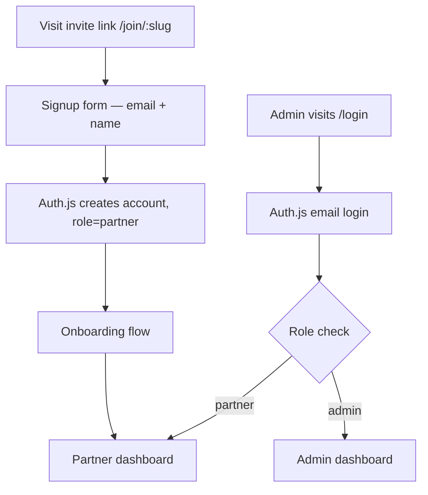

# Lawbrokr Partners — Project Scope

## Overview

Internal partner management tool replacing FirstPromoter. Tracks referral deals, commissions, and partner payouts. Two roles: **Admin** (Lawbrokr team) and **Partner** (external referral partners). No financial transactions — tracking and reporting only.

## Tech Stack

| Layer | Choice |
|-------|--------|
| Framework | Next.js 15 (App Router) |
| Hosting | Vercel |
| Database | Neon (Serverless Postgres) |
| Auth | Auth.js (NextAuth v5) + Neon adapter |
| UI | shadcn/ui + Tailwind CSS 4 |
| ORM | Drizzle (Neon's recommended ORM) |

## Roles & Access

| Role | Access |
|------|--------|
| **Admin** | Full dashboard, partner management, deal pipeline, commission ledger, create invite links |
| **Partner** | Personal dashboard, submit deals, view own commissions/payouts, manage payout details |

---

## Core Features

### Admin Side

1. **Dashboard** — overview stats: total partners, active deals, pending commissions, revenue attributed
2. **Partner Management** — list/search partners, view individual partner details, deactivate partners
3. **Invite Links** — generate unique signup URLs per campaign or partner cohort, set commission rate per link
4. **Deal Pipeline** — kanban or table view (New → In Progress → Closed Won → Lost), assign/reassign deals
5. **Commission Ledger** — track earned, pending, and paid commissions per partner, mark as paid manually
6. **Referral Log** — all referral activity with timestamps and attribution

### Partner Side

1. **Dashboard** — personal earnings summary, deal count, pending payouts
2. **Submit Deal** — form to log a new referral/deal (client name, deal value, notes, status)
3. **My Deals** — list of submitted deals with pipeline status visibility
4. **Commissions** — history of earned and paid commissions
5. **Payout Details** — securely save banking/payment info for admin reference (encrypted at rest)
6. **Onboarding** — guided setup after first login (profile → payout method → terms acceptance)

---

## Data Model (Draft)

```
users
├── id (uuid, pk)
├── email (unique)
├── name
├── role (enum: admin, partner)
├── created_at
└── updated_at

partners (extends user for partner-specific data)
├── id (uuid, pk)
├── user_id (fk → users)
├── referral_code (unique)
├── commission_rate (decimal, e.g. 0.20)
├── status (enum: active, inactive, pending)
├── invite_link_id (fk → invite_links, nullable)
├── onboarding_completed_at (timestamp, nullable)
├── created_at
└── updated_at

invite_links
├── id (uuid, pk)
├── slug (unique, used in URL)
├── label (admin-facing name, e.g. "Q2 Campaign")
├── default_commission_rate (decimal)
├── created_by (fk → users)
├── active (boolean)
├── created_at
└── expires_at (nullable)

deals
├── id (uuid, pk)
├── partner_id (fk → partners)
├── client_name
├── client_email (nullable)
├── deal_value (decimal)
├── status (enum: new, in_progress, closed_won, lost)
├── notes (text, nullable)
├── submitted_at
├── closed_at (nullable)
└── updated_at

commissions
├── id (uuid, pk)
├── deal_id (fk → deals)
├── partner_id (fk → partners)
├── amount (decimal)
├── status (enum: pending, approved, paid)
├── paid_at (nullable)
├── notes (nullable)
└── created_at

payout_details (encrypted fields)
├── id (uuid, pk)
├── partner_id (fk → partners, unique)
├── method (enum: bank_transfer, paypal, check, other)
├── encrypted_details (jsonb, encrypted — account number, routing, paypal email, etc.)
└── updated_at
```

---

## Auth Flow



- **Auth method:** Email magic link (Auth.js Email provider) — no passwords to manage
- **Session strategy:** JWT via Auth.js with role in token
- **Route protection:** Next.js middleware checks role, redirects unauthorized access
- **Admin creation:** Seed script or manual DB insert (no self-signup for admins)

---

## Route Structure

```
app/
├── (auth)/
│   ├── login/page.tsx              — email magic link login
│   └── join/[slug]/page.tsx        — partner signup via invite link
├── (admin)/
│   ├── layout.tsx                  — admin layout + nav, role-gated
│   ├── dashboard/page.tsx          — admin overview
│   ├── partners/page.tsx           — partner list
│   ├── partners/[id]/page.tsx      — individual partner detail
│   ├── invite-links/page.tsx       — manage invite links
│   ├── deals/page.tsx              — deal pipeline (all partners)
│   └── commissions/page.tsx        — commission ledger
├── (partner)/
│   ├── layout.tsx                  — partner layout + nav, role-gated
│   ├── dashboard/page.tsx          — partner home
│   ├── deals/page.tsx              — my deals list
│   ├── deals/new/page.tsx          — submit a deal
│   ├── commissions/page.tsx        — my commissions
│   ├── payout/page.tsx             — manage payout details
│   └── onboarding/page.tsx         — guided setup
└── api/
    └── auth/[...nextauth]/route.ts — Auth.js handler
```

---

## Security Considerations

- **Payout details encryption:** Use Neon column-level encryption or application-level AES-256 encryption for `payout_details.encrypted_details`. Decrypt only when admin views.
- **Role enforcement:** Middleware + server-side checks on every route and API call. Never trust client-side role alone.
- **Invite links:** Slugs should be non-guessable (nanoid or UUID). Support expiration and deactivation.
- **Rate limiting:** Apply to signup and login endpoints (Vercel's built-in or upstash ratelimit).

---

## Phase Plan

### Phase 1 — Foundation
- [ ] Project setup: Next.js + Neon + Auth.js + Drizzle + shadcn
- [ ] Auth flow: magic link login, role-based sessions
- [ ] DB schema + migrations
- [ ] Admin: create invite links
- [ ] Partner: signup via invite link, onboarding

### Phase 2 — Core Tracking
- [ ] Partner: submit deals form
- [ ] Admin: deal pipeline view (table + status management)
- [ ] Commission auto-calculation on deal close
- [ ] Admin: commission ledger, mark as paid

### Phase 3 — Dashboards & Polish
- [ ] Admin dashboard with summary stats
- [ ] Partner dashboard with personal stats
- [ ] Partner: payout details (encrypted storage)
- [ ] Referral log / activity feed

### Phase 4 — Future (Post-MVP)
- [ ] Referral link click tracking (pixel/redirect)
- [ ] Email notifications (deal status changes, commission paid)
- [ ] CSV export for accounting
- [ ] Stripe Connect or payout automation
- [ ] Multi-tier commission structures

---

## AI Prompt Structure

When working on this project in another repo, start Claude with:

```
You are building "Lawbrokr Partners" — an internal partner/referral tracking tool.

Stack: Next.js 15 (App Router), Neon Postgres, Auth.js v5, Drizzle ORM, shadcn/ui, Tailwind CSS 4, deployed to Vercel.

Two roles:
- Admin: manages partners, invite links, deal pipeline, commissions
- Partner: signs up via invite link, submits deals, views commissions, saves payout info

Key constraints:
- No financial transactions — tracking only. Payout details stored encrypted for admin reference.
- Auth via email magic links (Auth.js Email provider + Neon adapter)
- Role-based routing: /admin/* and /partner/* route groups with middleware protection
- Invite links are the only way partners can sign up — no open registration

Refer to the project scope at: vault/features/Lawbrokr-Partners/scope.md
```
