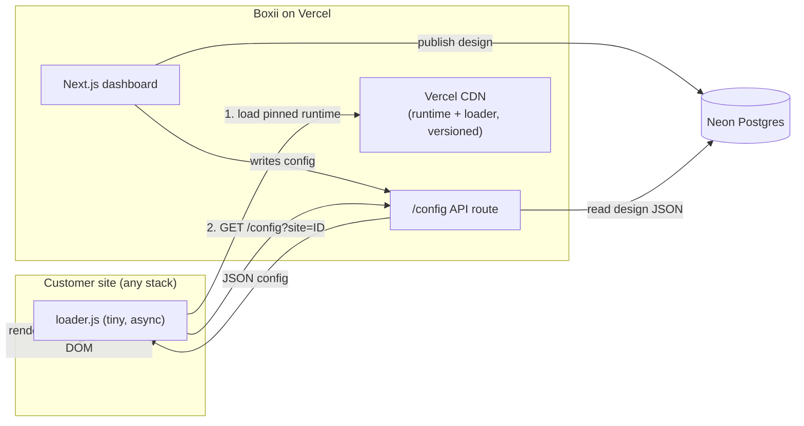
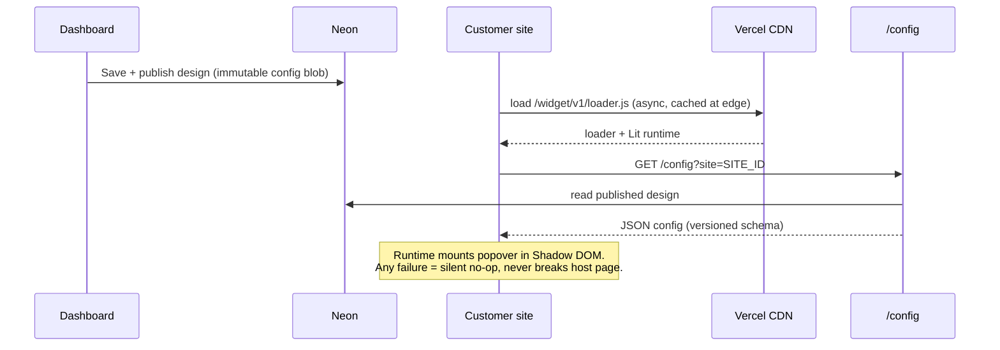

# Boxii — v1 Build Plan

> A manageable, incremental plan for building Boxii v1 on the smallest stack
> that works, with clear seams where additional providers can be added later
> **only when actually needed**.

## What Boxii Is

Boxii is a **Next.js dashboard** that customers use to **design popovers** for
their own websites. The popovers are built as **Lit web components** (Shadow
DOM, style-isolated). Customers paste a small **embeddable script** onto their
site — on any host or stack (WordPress, Webflow, Squarespace, raw HTML) — and
the Boxii **API returns the design** that the runtime renders into a popover.

Conceptually adjacent to `lawbrokr-js` (the existing embed/attribution client),
but a distinct concern: Boxii is about *designed popovers*, not attribution.

Working idea list (from original notes): "conversion intelligence" / custom
chatbot-style popover, plus widgets — maps, calling, practice area, image,
payment, scheduling (Calendly), client portal, social media.

## Guiding Principle

**Start with one ecosystem (Vercel + Neon). Add a provider only when a real
feature forces it — never preemptively.** Robustness comes from *delivery
discipline*, not from adding services. The `lawbrokr-js` deploy footgun ("if
there's no `-beta` tag every customer breaks") is the cautionary tale: the
architecture was fine; the *manual, mutable delivery* was the risk.

## Minimal v1 Stack

| Layer | v1 Choice | Notes |
|---|---|---|
| Dashboard UI | Next.js (App Router) + TypeScript + Tailwind + shadcn/ui | Matches Justice Frontend; team already knows it |
| Hosting + CDN | **Vercel** | Global CDN is included — serves loader + runtime + config |
| API / config endpoint | Next.js route handlers (same repo) | Returns **JSON config**, not live code |
| Database | **Neon Postgres** (+ Drizzle or Prisma) | Relational data: customers, sites, designs, config |
| Widget runtime | **Lit** bundled with **Vite** → ESM/IIFE, Shadow DOM on | Style isolation on unknown customer sites |
| Loader script | ~1–2KB hand-written vanilla JS, `async` | The thing customers paste once and you rarely touch |
| Auth | Reuse Lawbrokr SSO (or Auth.js as a library) | Not a new provider |

**The truly minimal viable stack is: Next.js (Vercel) + Neon.** Everything else
below is added later, on demand.

## Architecture (v1)

## Publish → Deliver → Render Flow

## The 7 Robustness Rules (delivery discipline, not extra providers)

1. **Immutable, versioned runtime URLs** — `cdn.boxii.com/widget/v1/loader.js`.
   A published version is never mutated. New behavior = new version. No shared
   mutable `latest` that everyone rides.
2. **Keep the loader dumb and stable** — it only (a) loads the pinned runtime
   and (b) fetches config. A stable loader means shipping features for years
   without touching customer sites.
3. **Return config (JSON), not live code** — pre-ship the compiled Lit runtime
   once; the API returns cacheable JSON. CSP-safe, CDN-cacheable, no `eval`.
4. **Backwards-compatibility contract** — runtime tolerates older config shapes.
   Version the config schema; never hard-require a new field.
5. **Fail invisible** — wrap everything in try/catch, load async, isolate in
   Shadow DOM. A broken Boxii widget must be a no-op, never a host-page error.
6. **CI guards instead of human discipline** — the pipeline (not a README note)
   refuses to overwrite an existing version and smoke-tests the asset after
   publish.
7. **Staged rollout** — beta channel → canary cohort → general. Automated and
   reversible.

## Provider Extension Points (add later, only when needed)

Design v1 so each of these is a swap behind a small interface, not a rewrite.

| When you need… | Add this provider | Trigger to add it |
|---|---|---|
| Customer-uploaded **images / logos / video** | **Vercel Blob** (later: Cloudflare R2 / S3) | The day you ship the image / Clips / social widgets |
| Cheaper CDN at scale | Cloudflare R2 + CDN / CloudFront | Bandwidth cost or edge-control needs grow |
| Error monitoring | **Honeybadger** (already used at Lawbrokr) | First production traffic |
| Own auth (if not reusing SSO) | Auth.js (library) → Clerk (vendor) only if needed | Only if Lawbrokr SSO can't be reused |
| Background jobs / scheduling | Vercel Cron → dedicated queue | Async publish, scheduled rollouts |
| Analytics on popover performance | Reuse existing Lawbrokr/Justice pipeline | "Conversion intelligence" feature work |

**Keep seams clean:** put storage behind a `Storage` interface, config delivery
behind a `ConfigSource` interface, and auth behind the app's session layer. Then
each table row above becomes a one-file swap.

## Suggested Build Phases

1. **Skeleton** — Next.js app on Vercel, Neon connected, auth wired (reuse SSO),
   one DB table for `designs`. Hello-world dashboard.
2. **Runtime + loader** — Lit popover runtime built with Vite, published to a
   **versioned** Vercel path. Tiny async loader. Hard-coded design first.
3. **Config API** — `/config?site=ID` returns published design JSON from Neon.
   Loader fetches and renders it. Establish the **config schema + version field**.
4. **Dashboard design tool** — CRUD a design, publish writes an immutable config
   blob, CDN/edge cache purged on publish.
5. **CI guards** — GitHub Actions: refuse to overwrite a live version, smoke-test
   the published asset, staged beta → general channels.
6. **First widget** — ship one real widget end-to-end (e.g. calling or
   scheduling — text/link/color only, no uploads → still no blob store needed).
7. **Add blob storage** — introduce Vercel Blob the moment the **image/video**
   widgets land. First "added provider," cleanly behind the `Storage` interface.

## Open Questions

- Does v1 include **media uploads** (image/video widgets)? If launch is
  text/links/colors only, ship on **literally just Next.js + Neon** and add
  blob storage in Phase 7.
- Reuse **Lawbrokr SSO**, or stand up Auth.js for Boxii?
- Is "conversion intelligence" (chatbot-style) in v1 scope, or a later phase?

## Related

- [[Boxii]] — original idea notes
- `lawbrokr-js` — existing embed/attribution client (delivery footgun = the
  thing this plan's robustness rules are designed to avoid)
