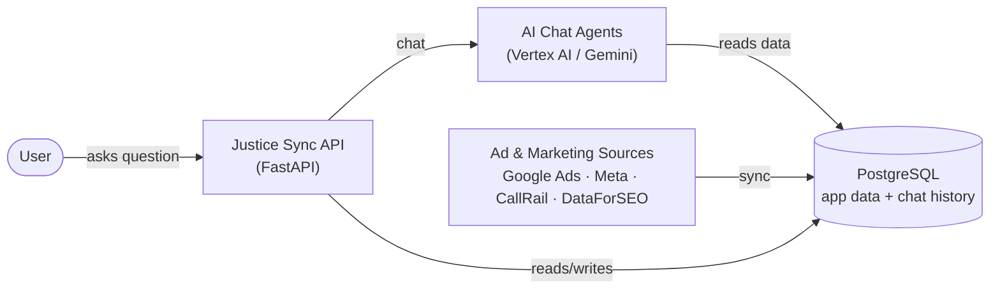
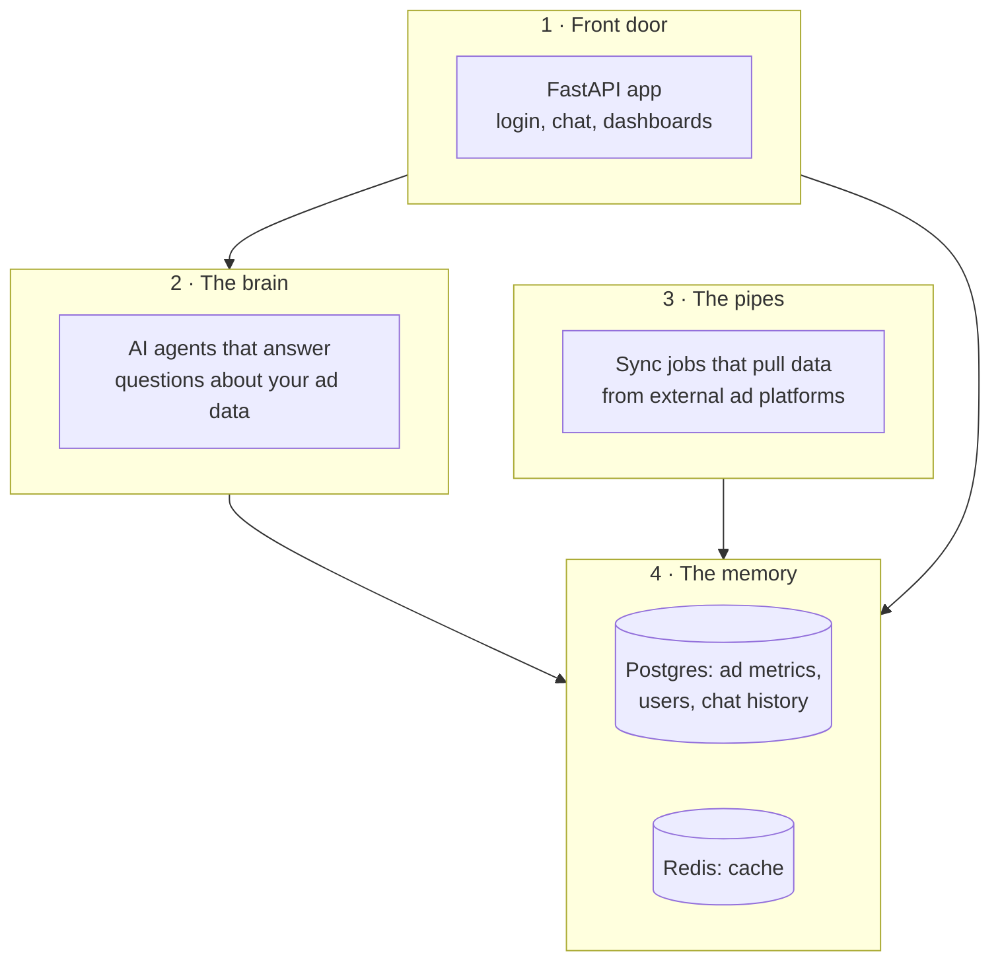
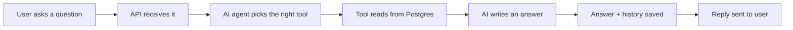
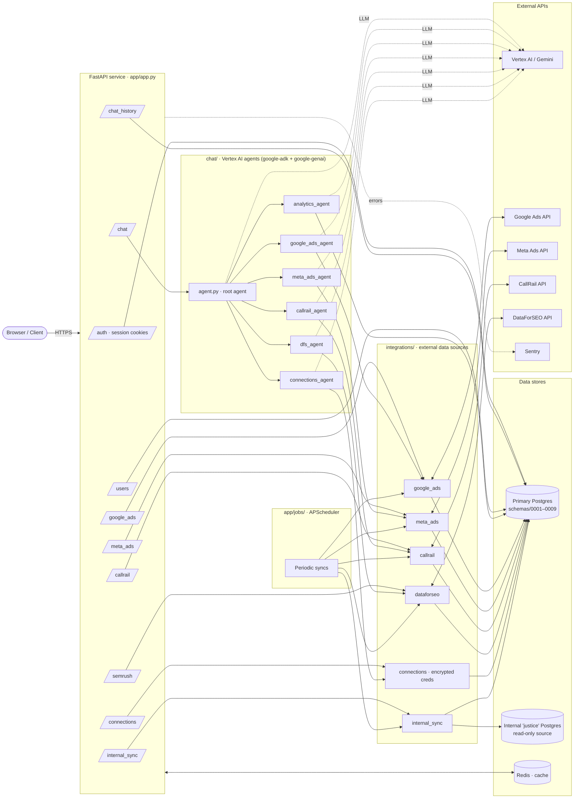
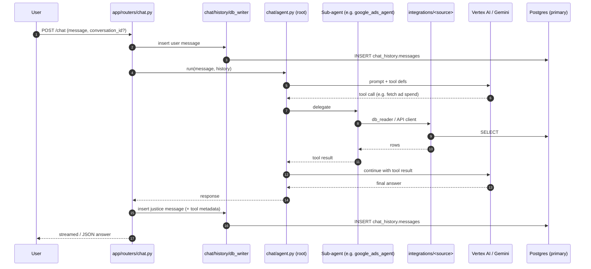
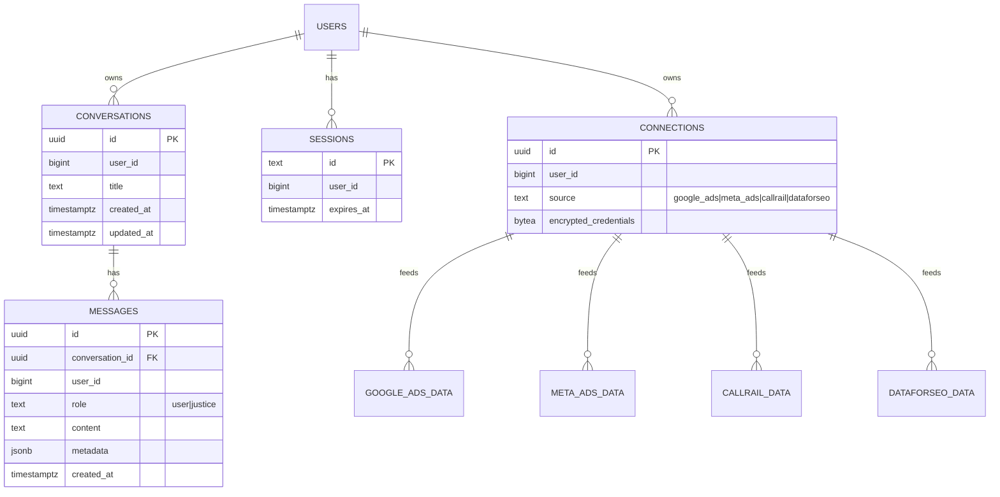
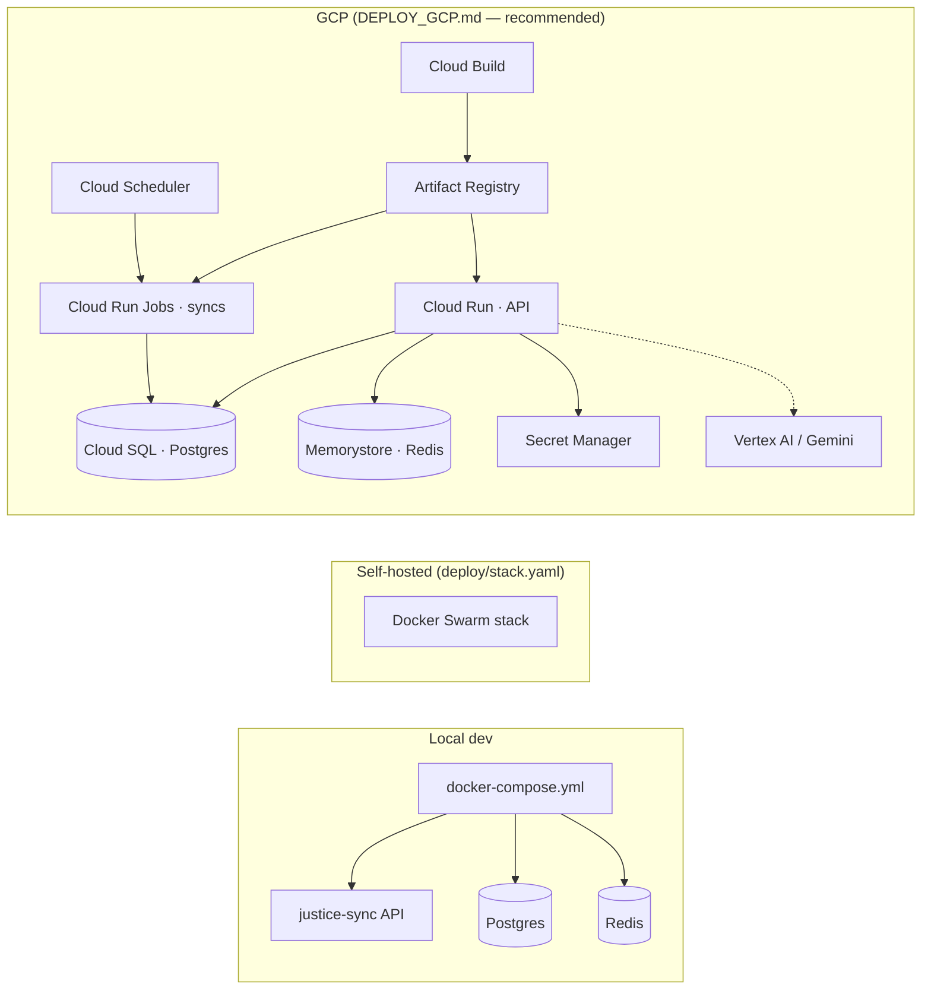

Internal dash - account management tab
Justrice beta
Popups

Text messaging SMS

---

ROI Attribution
Chloe stats - pull integrations - ROI card in analytics page

Lawbrokr lead magnet - capture lead details from existing landing page forms **ai magic optimization**

---

The following are enhancements that can be made to improve popups and also ensure that it has analytics so that it can support tracking detailed analytics.

1. Add support for all of the CTA buttons in the popups (ignoring those for closing it) to append to the URL the engaged_popup parameter with the popup identifier. This allows for tracking views and conversions and attributing it to the popup.
    
    1. For reference look at the clips.js implementation there is an `appendEngagedClipParam` function, you want to add a similar function for all of the popup CTA buttons to include as part of the URL the engaged_popup parameter and set the popup id
    2. For clips the token is the clip that is specified, this would be the same for popups where there can be a `popup` defined OR alternatively if none is defined then the Rails API will make a best effort to determine the default configured popup and will regardless return the `popup` as part of the response. For testing purposes if you want to update your Mock API to return the popup you can include in the JSON payload `"popup": "popup_69b8ffaed7bb57f394fad11f98a52945"`
    
2. By default if no popup is provided to the Rails API then it will attempt to determine the default popup configured for the law firm. You need to also add support where if a user explicitly configures the popup then that is used and provided to the API url. You can look at Clips and mimic the implementation for the API request as it would be the same for Pop Ups except Pop Ups attempts to return the default popup for the firm if none is provided.
    1. The following is an example configuration where a popup is explicitly provided, like how clips is done:

1. Add support for robust defaults to ensure a default popup is displayed if a user forgets to configure styles/fonts/colors for it.
    1. First look at the code for Clips for making the API request and ensure that for Pop Ups it's similar and handles performing the API requests and retrying on error and dealing with delayed initialization and other common challenges when operating in different website platform environments.
    2. Add support for a set of defaults that can be used if a user has not configured them for the Pop Ups, these should make the defaults match the first pop up theme (black and white theme) so that even if a user does not configure it and many fields are null the default pop up will still look good.
    3. NOTE: There are many cases where a user will not have a popup configured, similarly to how Clips is implemented, if no Popup is configured then there will be a `204` error code returned see the Clips implementation in `fetchClipDetails` for reference, you will want to stop retrying and not render the Popup as there has not been any configured.

---

# Justice Sync — Simple Overview

A high-level picture of how the pieces fit together.
For the detailed version, see the "Justice Sync — Architecture" section below.

> View in VS Code: **Cmd+Shift+V**. If diagrams show as text, install the
> "Markdown Preview Mermaid Support" extension.

## The big picture

## What each part does

## A chat request, simply

## Where things live

| Folder | What it is |
|---|---|
| `app/` | The FastAPI web service — routes, auth, settings, scheduler |
| `chat/` | The AI agents and chat history storage |
| `integrations/` | One folder per external data source (Google Ads, Meta, CallRail, DataForSEO, internal sync) |
| `schemas/` | SQL files that define the Postgres tables |
| `docker/` · `deploy/` | How to package and run it |
| `tests/` | Test suite |

---

# Justice Sync — Architecture

VS Code renders Mermaid in the built-in Markdown preview (Cmd+Shift+V). If a
diagram below appears as raw text, install the **"Markdown Preview Mermaid
Support"** extension (`bierner.markdown-mermaid`).

## 1. High-level system

## 2. Chat request lifecycle

## 3. Repository layout

```mermaid
flowchart TB
    Root[justice-sync/]

    Root --> AppDir[app/]
    Root --> ChatDir[chat/]
    Root --> IntDir[integrations/]
    Root --> SchemaDir[schemas/]
    Root --> Scripts[scripts/]
    Root --> Tests[tests/]
    Root --> Docker[docker/ + docker-compose.yml]
    Root --> Deploy[deploy/ stack.yaml]
    Root --> Docs[README · DEPLOY_GCP · FEATURES]

    AppDir --> AppApp[app.py · FastAPI entrypoint]
    AppDir --> AppDb[db.py · SQLAlchemy + psycopg2]
    AppDir --> AppCfg[config/settings.py]
    AppDir --> AppAuth[auth/session.py]
    AppDir --> AppRouters[routers/*]
    AppDir --> AppJobs[jobs/ · APScheduler]

    ChatDir --> CAgent[agent.py · root]
    ChatDir --> CSub[*_agent.py · per-source]
    ChatDir --> CHist[history/ db_reader · db_writer · models]
    ChatDir --> CConn[db_connector.py]

    IntDir --> IGA[google_ads/]
    IntDir --> IMA[meta_ads/]
    IntDir --> ICR2[callrail/]
    IntDir --> IDFS2[dataforseo/]
    IntDir --> ICN[connections/ · encryption]
    IntDir --> IIS[internal_sync/]

    SchemaDir --> S1[0001 core_setup]
    SchemaDir --> S2[0002 google_ads]
    SchemaDir --> S3[0003 meta_ads]
    SchemaDir --> S4[0004 dataforseo]
    SchemaDir --> S5[0005 callrail]
    SchemaDir --> S6[0006 internal_data]
    SchemaDir --> S7[0007 law_firm_connections]
    SchemaDir --> S8[0008 chat_history]
    SchemaDir --> S9[0009 sessions]
```

## 4. Postgres schemas (primary DB)

## 5. Deployment targets

